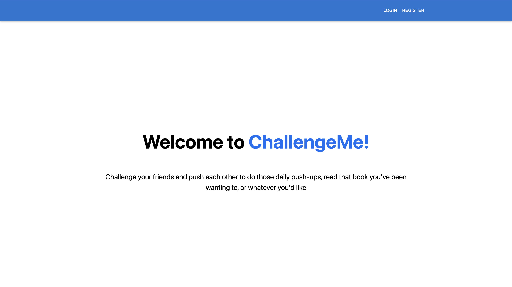
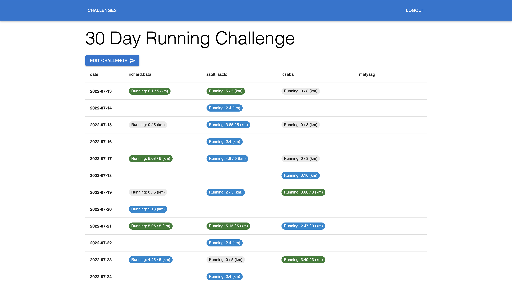
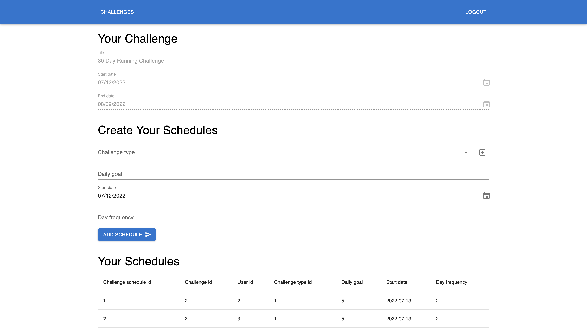
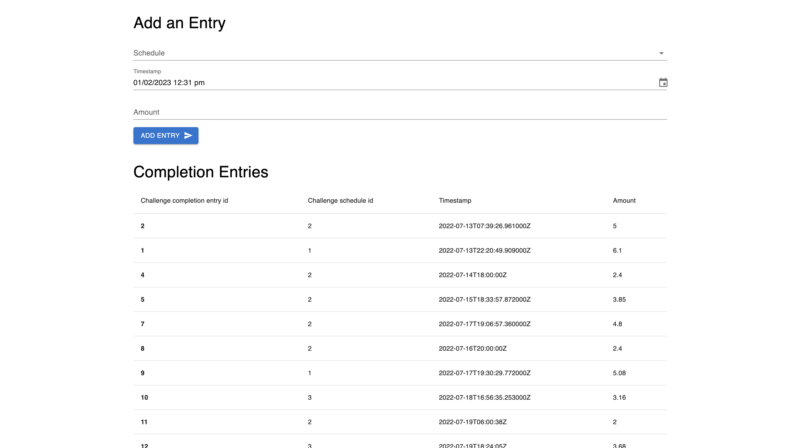

# ChallengeMe

Simple little web app that allows you and your friends to compete with each other in any challenge you might want, let it be a running challenge, or reading challenge, etc.

Available at: http://challengeme-env.eba-ea2mnien.eu-central-1.elasticbeanstalk.com/

### Tech stack:

- Django backend
  - Django REST framework
- Postgres database
- React + Typescript frontend
  - next.js
  - material-ui
  - react-hook-form
- Docker images and docker-compose
- GitHub Actions build and continuous deployment
- AWS hosting

### Screenshots

